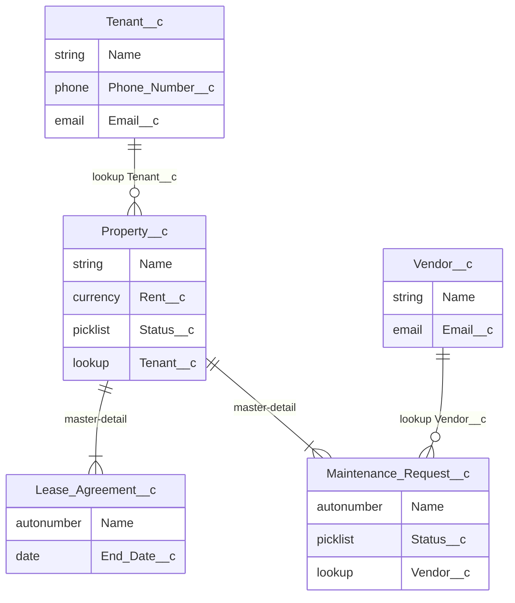
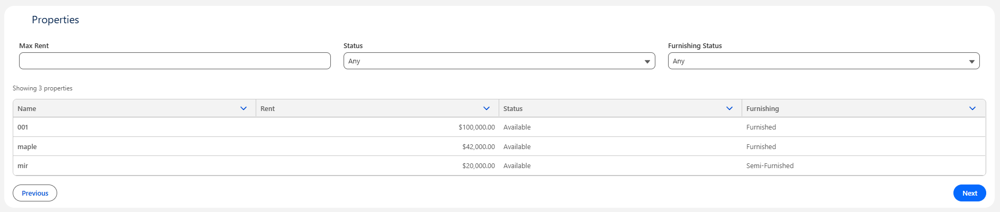
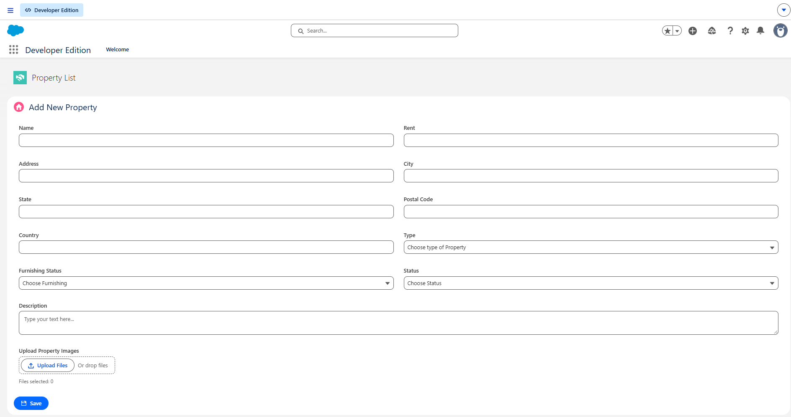
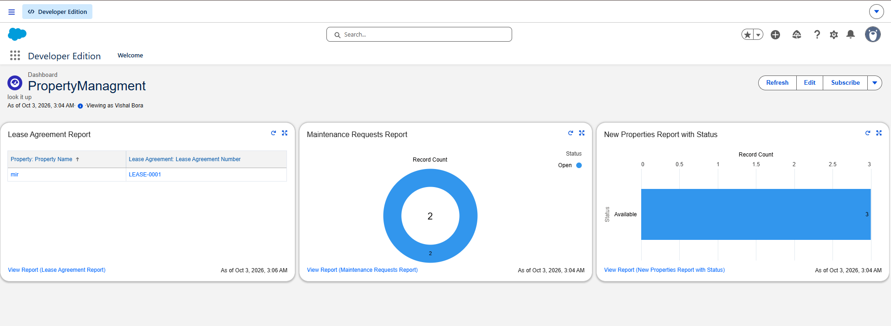

# Property Management (Salesforce)

A property management app on Salesforce covering properties, tenants, leases, vendors, and maintenance requests. Built with Salesforce CLI and VS Code on a Developer Edition org.

## What it does

- **Property list (LWC):** server-side pagination, 25 per page, with filters for max rent, availability, and furnishing.
- **Property create (LWC + Apex):** won't save without at least one file. Salesforce can't require a file with a validation rule, so the check lives in Apex.
- **Tenant assignment:** assigning a tenant to a property creates a "Generate lease agreement" task through a record-triggered Flow.
- **Maintenance requests:** a before-insert trigger assigns each new request to the vendor with the fewest Open and In Progress requests. Ties go to the first vendor alphabetically. I tested it with a 200-record insert.
- **Lease reminders:** scheduled Apex emails the tenant when a lease ends exactly 30 days from today. I used a single day instead of a 30-day window so nobody gets emailed every day for a month.
- **Dashboard:** leases ending in the next 30 days, maintenance requests by status, and occupancy.

Tenants, leases, and vendors use the standard Salesforce UI.

## Data model



Leases and maintenance requests are master-detail to Property, since neither means anything without one. Vendor is a lookup on the request so the history stays if a vendor is deleted. Field details are in [`docs/DATA_MODEL.md`](docs/DATA_MODEL.md). Feature list: [`docs/REQUIREMENTS.md`](docs/REQUIREMENTS.md).

## Automation choices

| Need | What I used | Why |
|---|---|---|
| Task on tenant assign | Record-triggered Flow | One extra record, no aggregation needed |
| Vendor auto-assign | Apex trigger + handler | Needs a grouped workload count and has to handle 200 records at once |
| Lease reminder | Scheduled Apex + `Messaging.sendEmail` | Runs on a schedule, not on a record change |
| Mandatory property image | Apex in the LWC save | Files can't be required by a validation rule |
| Occupancy and request counts | Standard reports | No roll-up summaries needed |

## Sharing and security

This is a single-admin Developer Edition org, so I kept the model simple.

| Object | Internal OWD |
|---|---|
| Property, Tenant, Vendor | Public Read/Write |
| Lease Agreement, Maintenance Request | Controlled by Parent (required for master-detail) |

External access is Private on Property, Tenant, and Vendor. There are no custom profiles, permission sets, or sharing rules. `PropertyController` is `with sharing`, so it would respect tighter sharing if I added it.

## Tests

14 tests, all passing, with **93%** coverage on the project classes (local tests, as of October 2026). They cover positive and negative paths, plus a **200-record** bulk insert on maintenance assignment.

```text
sf apex run test --test-level RunLocalTests --code-coverage --target-org YOUR_ALIAS --wait 10
```

## Deploy

You need [Salesforce CLI](https://developer.salesforce.com/tools/salesforcecli) and VS Code with the [Salesforce Extension Pack](https://developer.salesforce.com/tools/vscode/).

```text
sf org login web --alias YOUR_ALIAS
sf project deploy start --source-dir force-app --target-org YOUR_ALIAS
```

After deploying:

1. Activate the tenant-assignment Flow if it's inactive.
2. Schedule `LeaseExpiryReminder` to run daily under Apex Jobs.
3. Add the LWCs to a Lightning App Page.
4. Reports and the dashboard are in this repo and deploy with `force-app`. Rebuild them in Setup only if that metadata was skipped.

API version 65.0 (see `sfdx-project.json`).

## Screenshots





## Known limitations

- No permission sets or role-based access.
- No external integrations.
- The reminder job runs once a day, so if it fails on the day a lease hits 30 days, that lease is skipped.
- Vendor assignment only counts Open and In Progress requests. It doesn't consider vendor skills or location.
- The file requirement is enforced on the LWC create path, not on the standard Property New button.
- Creating a property that already has a tenant can skip the lease Task (Flow `IsChanged` is often false on insert).
